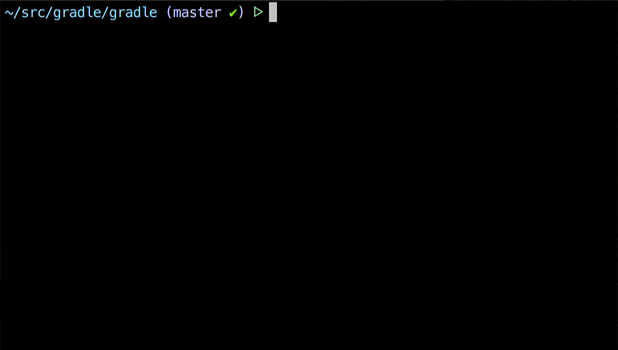

# gradle-completion
Bash and Zsh completion support for [Gradle](https://gradle.org).

This provides _fast_ tab completion for:

 * Gradle tasks for the current project and sub-projects
 * Gradle CLI switches (e.g. `--parallel`)
 * Common Gradle properties (e.g. `-Dorg.gradle.debug`)

It also handles custom default build files, so `rootProject.defaultBuildFile = 'build.gradle.kts'` is supported.

Here's a demo for the gradle project itself:


## Installation for Zsh 5.0+

Download and place `gradle-completion.zsh` on your `$fpath`. I recommend `$HOME/.zsh/gradle-completion`:
```
git clone git://github.com/eriwen/gradle-completion ~/.zsh/gradle-completion
```

Add the following do your '.zshrc' file:
```
echo "\nfpath=($HOME/.zsh/gradle-completion \$fpath)" >> ~/.zshrc
```

Start a new terminal session. You may need to disable the `gradle` plugin for `oh-my-zsh`.

## Installation for Bash 3.2+

Download and place `gradle-completion.bash` in your `bash_completion.d` folder, usually `/etc/bash_completion.d`, `/usr/local/etc/bash_completion.d`, or `$HOME/bash_completion.d`:
```
mkdir $HOME/bash_completion.d
wget -O $HOME/bash_completion.d/gradle-completion.bash https://raw.githubusercontent.com/eriwen/gradle-completion/master/gradle-completion.bash
```

Add the following to your `.bashrc` file:
```
source $HOME/bash_completion.d/gradle-completion.bash
```

Start a new terminal session.

## Additional Configuration

#### Cache config
The build script cache is invalidated if any *.gradle or *.gradle.kts files change. 
However, these completion scripts do not search for new build scripts every time completion is invoked, because
that would make completion ~20x slower (unless you have so really good ideas on this).

By default, the build script cache is invalidated every 3 weeks (30240 minutes). 
You can configure this value by exporting a new value for `$GRADLE_CACHE_TTL_MINUTES`:
```
export GRADLE_CACHE_TTL_MINUTES=$(expr 1440 \* number_of_days_you_want)
```

#### Implicit Tasks
Gradle allows you to access tasks of subprojects from the project root implicitly.
For example, given these tasks:
```
:foo
:help
:bar:baz
```

You can execute `gradle baz` from the project root and it will execute `:bar:baz`.

gradle-completion will not tab complete these tasks by default because it adds a
significant number of completion options, which may not be what you want and 
negatively impacts completion speed.

To allow completion of implicit tasks, set `$GRADLE_COMPLETION_IMPLICIT_TASKS=true`:

```bash
export GRADLE_COMPLETION_IMPLICIT_TASKS="true"
```

You may need to invalidate the cache using the cache config above or by executing `touch build.gradle`.

## Troubleshooting
If zsh completion isn't working, first try checking your `$fpath` with `echo $fpath`. 

zsh completion using `./gradlew` may not work on Linux if you don't have `.` on your `$PATH`,
so I recommend adding it in your `~/.zshrc` file:
```bash
export PATH=".:$PATH"
```

If zsh completion reports "Generating Gradle task cache..." every time, the zsh completion cache
may be disabled. Enable it by adding the following to your `~/.zshrc` file:
```bash
zstyle ':completion:*' use-cache on
```

Completion outside of the root project directory isn't supported yet. 
Please follow [#3](https://github.com/eriwen/gradle-completion/issues/3) — contributions welcome!

## Acknowledgements
Bash completion is inspired by [Nolan Lawson's Gradle tab completion for bash](https://gist.github.com/nolanlawson/8694399).

Zsh completion is an improved version of [zsh](https://github.com/zsh-users/zsh)'s built-in Gradle completion. The intent is for mature improvements to be merged back into zsh.

Current improvements over built-in support:
 - Subproject tasks are completed
 - Gradle CLI options are current as of Gradle 3.3
 - Common Gradle properties are completed
 - Handles default build file as specified in settings.gradle
 - ~20x faster completion speed for medium to large projects
